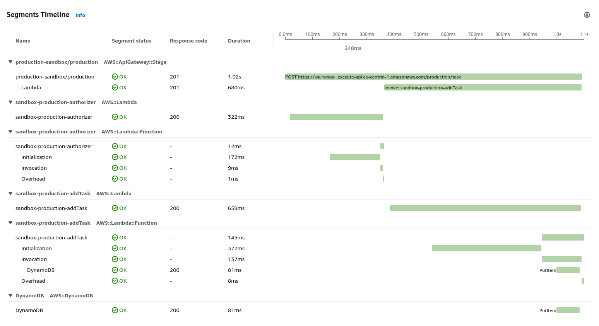

# AWS Serverless DynamoDB Sandbox

Example of the simple AWS serverless application with DynamoDB, Typescript and tests.

## Contains

* Lambdas in typescript (see [src/handlers/](src/handlers/))
* Working with DynamoDB (see [src/database/taskRepository.ts](src/database/taskRepository.ts))
* [ZOD validation library](https://zod.dev/)
* Local environment (run `npm run offline`)
* Serverless with configuration in typescript (see [serverless.ts](serverless.ts))
* Tests on offline environment and local database (run `npm run test:offline`, see [src/handlers/addTask.test.offline.ts](src/handlers/addTask.test.offline.ts))
* Tests on AWS (run `AWS_ACCESS_KEY_ID=... AWS_SECRET_ACCESS_KEY=... npm run test:e2e`, see [src/handlers/addTask.test.e2e.ts](src/handlers/addTask.test.e2e.ts))
* Simple custom authorizer, allows to add multiple access tokens and define custom allowed endpoints (see [src/handlers/authorizer.ts](src/handlers/authorizer.ts)) 
* AWS SDK version 3 (see [src/database/createDynamoDbDocumentClient.ts](src/database/createDynamoDbDocumentClient.ts))
* Source maps for debugging typescript in AWS 


* XRAY



## Prepare development enviroment

Authenticating to GitHub Packages
see [there](https://help.github.com/en/github/managing-packages-with-github-packages/configuring-npm-for-use-with-github-packages#authenticating-to-github-packages)

* Clone project
* Install dependencies
```bash
> npm ci
```
* Install local database
```bash
> npx sls dynamodb install
``` 
* Run offline
```bash
> npm run offline
```
* Send POST request to
```
POST http://localhost:3000/task

data:

{
    "description": "my value" 
}
```

### Deploy

Run:
```
> AWS_ACCESS_KEY_ID=... AWS_SECRET_ACCESS_KEY=... npm run start
```

### Todo
* add endpoints for remove task, list tasks and update task
* add tests and lint to GitHub actions
